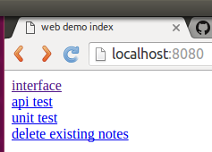

## angularjs interface embedded in an iOS app
really just learning swift

and messing around with
angularjs,
jasmine tests in embedded browsers,
local REST apis,
travis-ci,
protractor,
iOS UI tests,
and swizzling

If you actually want use an angularjs interface in an native app, you might be
better off using the WebKit framework and messageHandlers, but I had my heart
set on connecting to a local RESTful API with and angular's $resource.

#### general idea

This has two main screens
* an embedded angular screen for data entry and recent history
* a native table view showing the full history

 

##### desktop browser for development

The html view can also run in a desktop browser for quick development, and
selenium testing.


If you are wondering, I don't have a favicon, and Jenkins was the last favicon
to use localhost:8080

#### running and testing

###### run on device or ios simulator

You must have bower, node/npm installed globally for this to work.
(and you must be using a mac)

```bash
git clone <address for this repo>
cd native-ios-with-html-interface
cd www
bower install #download angular, jquery...
cd ..
open ios/demo.xcodeproj
```


Then choose one of the schemes and key combinations:

| in order to | choose scheme | key combination |
|---|---|---|
| run normally | "demo"  | &#8984;+R |
| test internal api | "api-test" | &#8984;+R |
| test angular code | "unit test js" | &#8984;+R |
| debug with safari | "debug"  | &#8984;+R |
| run most tests | "demo" | &#8984;+U |

If you don't have ant installed, it might be just as easy to read build.xml
and execute the commands yourself.

###### run html interface in mock environment

You must have bower, node/npm installed globally for this to work.
(but you don't need a mac - you can develop the interface on linux/unix)

I hope you are not using port 8080 for anything.
I haven't made it configurable.

```bash
git clone <address for this repo>
cd native-ios-with-html-interface
cd www
bower install #download angular, jquery...
npm install #download express...
node test-server.js
```


now go to http://localhost:8080 in your browser



* 'interface' shows the embedded angular interface in the desktop browser using
the express rest api (as in the picture a few sections up)
* 'api test' runs the jasmine api tests in the browser to make sure that the mock
api is a good representation of the rest api that we are using to communicate
with the native ios layer on the device
* 'unit test' runs the same jasmine tests on the angular controller.
It should be the same result as on the device, but being able to run it here
allows for quicker development of the interface.
* 'delete existing notes' clears the test database

###### run protractor tests

To run the protractor tests on the web interface, you must have protractor installed.

* First run the test server as in the section above.
* In another terminal:
```bash
webdriver-manager update
webdriver-manager start
```
* and then in another terminal:
```bash
cd <project directory>
protractor www/test/protractor/conf.js
```

That would be great to add these tests to travis.

##### There are tons of possibilities for testing

Tests that are run when you type command+U in xcode:
* UI Tests running through the full process
* Unit tests for table view controller
* Unit tests for database

Tests that have to be run using the desktop browser:
* Protractor tests running through web interface

Tests that are run when you type command+U in xcode but can also be run in the
desktop browser
* jasmine unit tests for angular controller
* jasmine api tests
* a bash script that makes sure there are no duplicate asset file names


### interesting bits of code

<a href="ios/demo/URLProtocol.swift">implement a RESTful API using NSURLProtocol</a>
and
<a href="www/test-server.js">implement a mock of the API using node.js and express</a>
and
<a href="www/test/api-test.js">use the same set of jasmine tests to test both of them</a>


***

<a href="ios/demo/WebViewController.swift">view controller</a>
that loads the angular
<a href="www/index.html">html</a> and <a href="www/interface.js">js</a>
but can also load the api jasmine tests or the
<a href="www/test/unit-test.js">jasmine unit tests</a>
as well as a special <a href="ios/demo/pause.html">pause script</a>
for safari debugging


***

<a href="ios/demo/WebViewController.swift">intercept attempted page loads</a>
to repond to links, and replace them with modals, or forward external addresses
to safari.  This can also be used for commands from javascript using window.location

***

use the <a href="ios/demoUITests/demoUITests.swift">XCTest UI tests</a> to run the in browser jasmine tests as
part of the test target, with help from
<a href="www/test/signal-when-finished.js">this js file</a> which gives a signal
when the jasmine tests are finished running

***

copy all web assets to ios bundle from <a href="www/files.txt">a list</a>
using this <a href="ios/copy-web-files.sh">shell script</a> then serve the same
list of assets from the root of the <a href="www/test-server.js">test server</a>
so that the same paths work

***

<a href="www/test/protractor/spec.js">protractor test</a> the angular interface
using the mock api

***

<a href=".travis.yml">.travis.yml</a> file that works with ios UITests

***

how I struggled to make mock objects for
<a href="ios/demoTests/tableViewTests.swift">tableview controller tests</a>
in swift because of the strict types

***

swizzling in the
<a href="ios/demoTests/webViewTests.swift">webview controller tests</a>
because I couldn't get my usual mock objects scheme to work in swift
